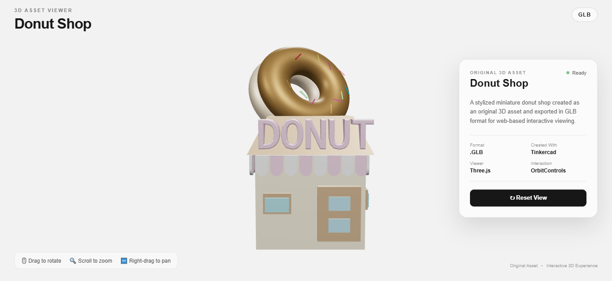
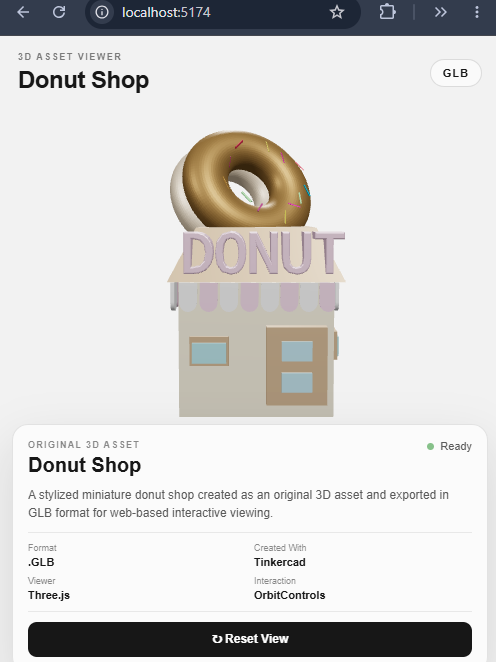

# 🍩 Donut Shop — Interactive 3D Asset Viewer

An interactive web-based 3D asset viewer showcasing an original stylized miniature donut shop.

The 3D asset was created in **Tinkercad**, exported as a **GLB (.glb)** file, and integrated into a React application using **Three.js** for real-time interactive viewing.

[🌐 Live Demo](https://ephemeral-licorice-171363.netlify.app/) ·
[💻 GitHub Repository](YOUR_GITHUB_REPOSITORY_URL)

---

## 📸 Preview

### Desktop



### Mobile



---

## ✨ Features

- Interactive GLB 3D model viewer
- Rotate the model using mouse/touch interaction
- Zoom in and out
- Pan across the 3D scene
- Reset camera to the default view
- Automatic camera framing based on model dimensions
- Adaptive camera positioning for mobile screens
- Responsive desktop and mobile layouts
- Loading state while the 3D asset is loading
- Error state for failed 3D asset loading
- Realistic lighting and shadow support
- React component-based architecture
- Production-ready Vite build

---

## 🎨 3D Asset

### Donut Shop

The project features an original stylized miniature donut shop created as a 3D asset.

The scene includes:

- Donut-shaped rooftop sign
- Donut shop building
- Large "DONUT" signage
- Decorative awning
- Windows
- Entrance
- Stylized pastel color palette

The asset was created using **Tinkercad** and exported as a **GLB (.glb)** file for web-based 3D viewing.

---

## 🖥️ Interactive 3D Viewer

The application uses **Three.js** to render and display the GLB model directly in the browser.

### Controls

| Interaction | Action              |
| ----------- | ------------------- |
| Rotate      | Drag with the mouse |
| Zoom        | Scroll              |
| Pan         | Right-drag          |
| Reset       | Click "Reset View"  |

The viewer uses **OrbitControls** to provide interactive camera movement.

The camera automatically calculates the model's dimensions and positions itself so that the complete asset is visible when the viewer loads.

The camera framing also adapts to smaller screen sizes to maintain a usable mobile experience.

---

## 💡 Lighting & Rendering

The 3D scene uses multiple Three.js lights to improve the visual presentation of the asset:

- Ambient light
- Directional key light
- Directional fill light
- Rim light

The renderer also includes:

- Anti-aliasing
- sRGB color space
- ACES filmic tone mapping
- Shadow mapping
- Soft shadow support

---

## 📱 Responsive Design

The viewer is designed to work across different screen sizes.

### Desktop

The 3D model occupies the main viewing area while the information card is positioned alongside the model.

### Mobile

The layout adapts by placing the 3D viewer in the upper portion of the screen and the information card below it.

The camera is automatically reframed on smaller screens to keep the 3D asset visible and usable.

---

## 🛠️ Technology Stack

### Frontend

- React
- Vite
- JavaScript
- CSS

### 3D

- Three.js
- GLTFLoader
- OrbitControls
- GLB / glTF

### 3D Creation

- Tinkercad

### Development Tools

- Visual Studio Code
- Git
- GitHub

---

## 📁 Project Structure

```text
donut-shop-viewer/
│
├── public/
│   ├── models/
│   │   └── donut-shop.glb
│   │
│   └── screenshots/
│       ├── desktop-preview.png
│       └── mobile-preview.png
│
├── src/
│   ├── components/
│   │   └── ThreeViewer.jsx
│   │
│   ├── App.jsx
│   ├── App.css
│   ├── index.css
│   └── main.jsx
│
├── .gitignore
├── eslint.config.js
├── index.html
├── package.json
├── package-lock.json
├── README.md
└── vite.config.js
```

🚀 Getting Started
Prerequisites

Make sure you have the following installed:

Node.js
npm
Git

1. Clone the repository
   git clone YOUR_GITHUB_REPOSITORY_URL
2. Navigate to the project
   cd donut-shop-viewer
3. Install dependencies
   npm install
4. Start the development server
   npm run dev

Vite will provide a local development URL in the terminal.

Open that URL in your browser to launch the 3D viewer.

📦 Production Build

To create an optimized production build:

npm run build

To preview the production build locally:

npm run preview

The project has been tested with the production build to ensure that it compiles successfully.

🔍 Code Quality

The project uses ESLint for code quality checks.

Run:

npm run lint

The current project passes the ESLint check without errors.

🎯 Internship Task

This project was created as part of the:

Algoryx 3D Developer Internship Task

The project demonstrates:

3D asset creation
3D asset export
Web-based 3D rendering
Three.js integration
React development
Interactive camera controls
Responsive UI development
Error and loading state handling
Production build configuration
👩‍💻 Author
Devanshi Tamrakar

B.Tech Information Technology Student

GitHub:https://github.com/tamrakardevanshi-source

LinkedIn: LinkedIn Profile

Live Demo: https://ephemeral-licorice-171363.netlify.app/
